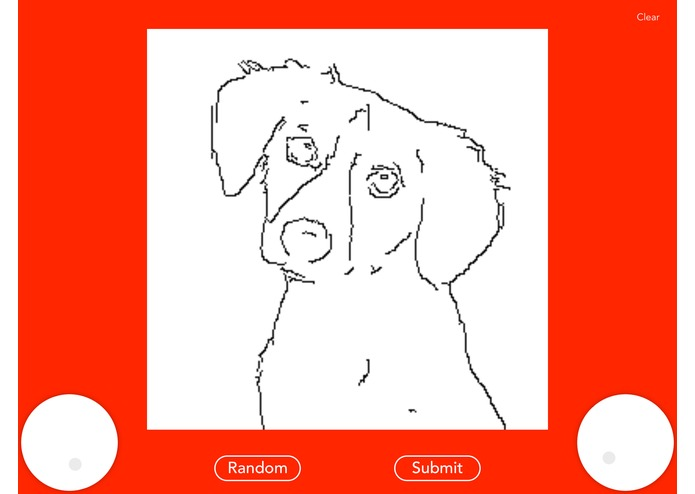
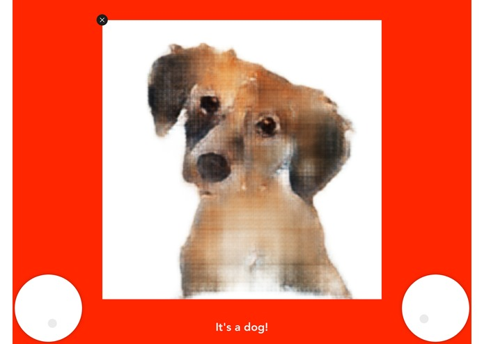
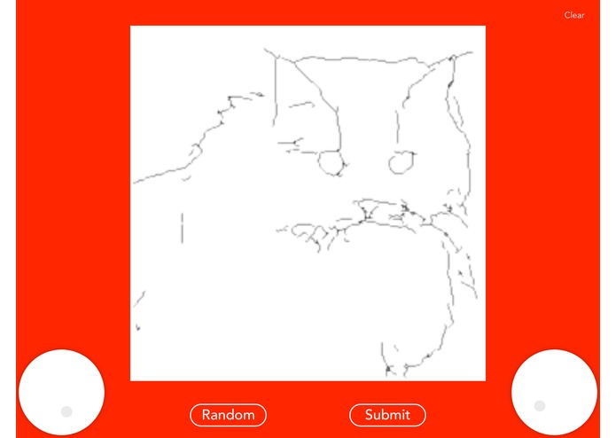
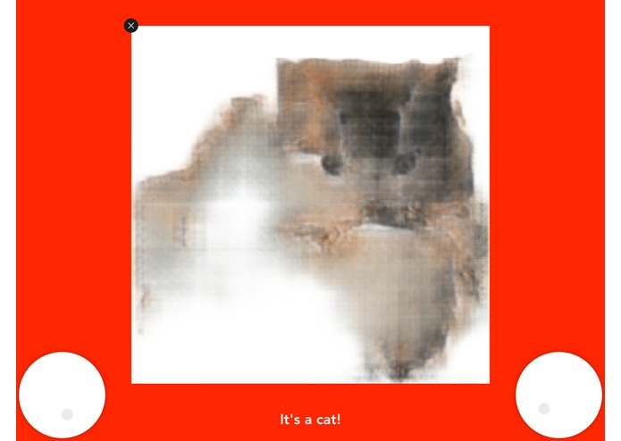

# EtchACat
Etch-A-Cat brings Etch-A-Sketch to iPad with a silly twist. You can draw anything by rotating the Etch-A-Sketch knobs.
(Or cheat and use your finger directly on the drawing surface.) Hit "Submit" when you are ready to fill in your image.
The app determines whether your drawing is more likely to be of a cat or of a dog and converts your image into an image
of that animal.

This repository is for the iOS side. If you're interested in the machine learning, check out Chris's [repository](https://github.com/chrisyeh96/pix2pix-tensorflow).

 

 
